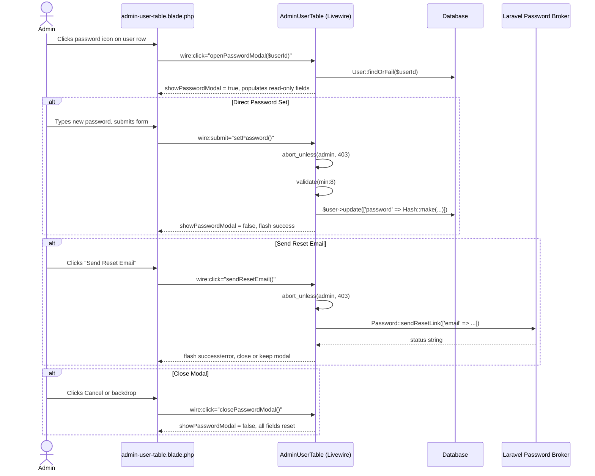

# Design Document: Admin User Password Management

## Overview

This feature extends the existing `AdminUserTable` Livewire component with password management capabilities. Admins can either set a new password directly for any user, or trigger a standard Laravel password reset email. Both actions are surfaced through a new modal within the existing component — no new routes, controllers, or pages are required.

The design follows the same patterns already established in `AdminUserTable`: public Livewire properties for modal state, `validate()` for input validation, `session()->flash()` for feedback, and `@if($showModal)` guards in the blade view.

## Architecture

All logic lives inside the existing `AdminUserTable` Livewire component. There are no new classes, services, or routes.



## Components and Interfaces

### AdminUserTable — new public properties

| Property | Type | Purpose |
|---|---|---|
| `$showPasswordModal` | `bool` | Controls modal visibility |
| `$passwordUserId` | `int\|null` | ID of the target user |
| `$passwordUserName` | `string` | Read-only display name in modal |
| `$passwordUserEmail` | `string` | Read-only display email in modal |
| `$newPasswordValue` | `string` | The new password entered by the admin |

### AdminUserTable — new methods

**`openPasswordModal(int $userId): void`**
- Loads the target user via `User::findOrFail($userId)`
- Populates `$passwordUserId`, `$passwordUserName`, `$passwordUserEmail`
- Resets `$newPasswordValue` to `''`
- Sets `$showPasswordModal = true`
- No authorization check here — the button is only rendered for admins, and the action methods guard themselves

**`setPassword(): void`**
- Calls `abort_unless(auth()->user()->hasRole('admin'), 403)`
- Validates `$newPasswordValue` with rule `required|string|min:8`
- On pass: loads user, calls `$user->update(['password' => Hash::make($this->newPasswordValue)])`, calls `closePasswordModal()`, flashes success
- On fail: Livewire surfaces inline `@error` messages; modal stays open

**`sendResetEmail(): void`**
- Calls `abort_unless(auth()->user()->hasRole('admin'), 403)`
- Calls `Password::sendResetLink(['email' => $this->passwordUserEmail])`
- If status is `Password::RESET_LINK_SENT`: calls `closePasswordModal()`, flashes success
- Otherwise: flashes error, modal stays open

**`closePasswordModal(): void`**
- Resets `$showPasswordModal`, `$passwordUserId`, `$passwordUserName`, `$passwordUserEmail`, `$newPasswordValue` to defaults

### Blade additions

1. A password icon button added to each row's actions `<div>`, alongside the existing edit/suspend/delete buttons:
   ```html
   <button wire:click="openPasswordModal({{ $user->id }})" ...>
       <span class="material-symbols-outlined text-[18px]">lock_reset</span>
   </button>
   ```

2. A new `@if($showPasswordModal)` modal block appended after the existing Edit modal, following the same structure (backdrop, card, form).

## Data Models

No schema changes. The `users` table already has a `password` column. The `password_reset_tokens` table (standard Laravel) is used by the password broker and requires no changes.

The only data mutation is a direct `UPDATE` on `users.password` (hashed via `Hash::make()`), which is already how `createUser()` works in the component.

## Correctness Properties

*A property is a characteristic or behavior that should hold true across all valid executions of a system — essentially, a formal statement about what the system should do. Properties serve as the bridge between human-readable specifications and machine-verifiable correctness guarantees.*


### Property 1: Modal opens with correct target user data

*For any* user in the system, when an admin calls `openPasswordModal($userId)`, the component's `showPasswordModal` property should be `true`, `passwordUserName` should equal that user's name, and `passwordUserEmail` should equal that user's email.

**Validates: Requirements 1.1**

### Property 2: Short passwords are rejected and modal stays open

*For any* password string shorter than 8 characters, calling `setPassword()` should produce a validation error on `newPasswordValue` and leave `showPasswordModal` as `true`.

**Validates: Requirements 1.2, 1.5**

### Property 3: Password set is a hash round-trip

*For any* valid password string (8+ characters), after `setPassword()` succeeds, the target user's stored password hash should verify against the original plaintext via `Hash::check()`.

**Validates: Requirements 1.3**

### Property 4: Non-admin users see no password management controls

*For any* user without the `admin` role (student or instructor), the rendered component output should not contain the password management button.

**Validates: Requirements 3.1**

### Property 5: Non-admin direct invocation returns 403

*For any* user without the `admin` role, directly calling either `setPassword()` or `sendResetEmail()` on the component should abort with a 403 HTTP response.

**Validates: Requirements 3.2, 3.3**

## Error Handling

| Scenario | Handling |
|---|---|
| `setPassword()` called with password < 8 chars | Livewire validation error on `newPasswordValue`; modal stays open |
| `setPassword()` called by non-admin | `abort(403)` |
| `sendResetEmail()` — broker returns non-`RESET_LINK_SENT` status | `session()->flash('error', ...)`, modal stays open |
| `sendResetEmail()` called by non-admin | `abort(403)` |
| `openPasswordModal()` with invalid user ID | `User::findOrFail()` throws `ModelNotFoundException` → standard 404 |
| `closePasswordModal()` called at any time | Safe no-op if modal is already closed; all fields reset |

The `abort_unless` guard is placed at the top of both `setPassword()` and `sendResetEmail()` so it fires before any database or broker interaction, regardless of how the call was made (UI or crafted Livewire request).

## Testing Strategy

### Unit / Feature Tests (PHPUnit + Livewire testing utilities)

These cover specific examples, integration points, and error conditions. They extend the existing `AdminUserTableTest` pattern (SQLite in-memory, `RefreshDatabase`, `RolesAndPermissionsSeeder`).

Specific examples to cover:
- Admin opens modal for a user → correct name/email populated (example for Property 1)
- Admin sets valid password → DB hash verifies, modal closes, success flash (example for Property 3)
- Admin sends reset email (mocked broker) → modal closes, success flash (Requirement 2.2)
- Admin sends reset email to unverified user → broker still called (Requirement 2.4)
- Broker failure → error flash, modal stays open (Requirement 2.3)
- Admin sets password for own account → succeeds (Requirement 1.6)
- `closePasswordModal()` resets all fields (Requirement 4.3)

### Property-Based Tests (PHPUnit + Pest + `spatie/pest-plugin-test-time` or `eris/eris`)

The recommended PBT library for this Laravel project is **[`giorgiosironi/eris`](https://github.com/giorgiosironi/eris)** (PHP property-based testing library compatible with PHPUnit). Alternatively, if the team prefers Pest, **[`pestphp/pest`](https://pestphp.com/)** with a custom generator helper works well.

Each property test must run a minimum of **100 iterations**.

Each test must include a comment tag in the format:
`// Feature: admin-user-password-management, Property {N}: {property_text}`

**Property 1 test** — generate random users, call `openPasswordModal`, assert modal state and populated fields match.
`// Feature: admin-user-password-management, Property 1: Modal opens with correct target user data`

**Property 2 test** — generate random strings of length 0–7, call `setPassword()`, assert validation error present and `showPasswordModal` is still `true`.
`// Feature: admin-user-password-management, Property 2: Short passwords are rejected and modal stays open`

**Property 3 test** — generate random strings of length 8–64, call `setPassword()`, assert `Hash::check($plain, $user->fresh()->password)` is `true`.
`// Feature: admin-user-password-management, Property 3: Password set is a hash round-trip`

**Property 4 test** — generate random non-admin users (student/instructor), render component, assert password button absent from output.
`// Feature: admin-user-password-management, Property 4: Non-admin users see no password management controls`

**Property 5 test** — generate random non-admin users, call `setPassword()` and `sendResetEmail()`, assert both throw/abort with 403.
`// Feature: admin-user-password-management, Property 5: Non-admin direct invocation returns 403`
