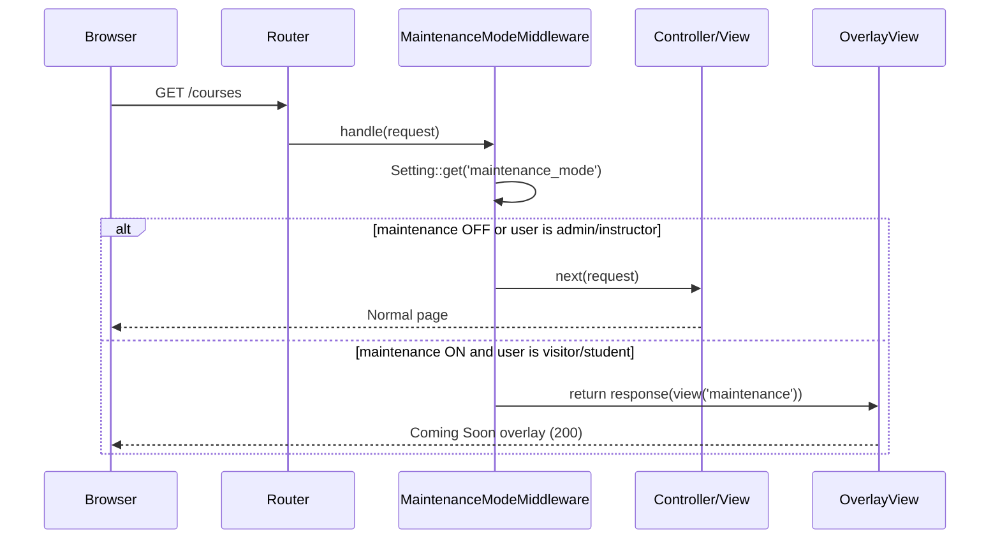

# Design Document: Maintenance Mode

## Overview

This feature wires the existing `maintenance_mode` setting to four public-facing pages (`/courses`, `/courses/{slug}`, `/mentors`, `/pricing`) by rendering a branded "coming soon" overlay whenever the setting is truthy. Admins and instructors are exempt and always see the real page. The implementation is intentionally thin: a single Blade component, a single middleware class, and minimal changes to the four affected routes.

## Architecture

The overlay is enforced at the **HTTP middleware layer**, not inside controllers or Livewire components. This keeps business logic out of views and makes the exemption rule a single, auditable place.



The middleware returns a normal `200` response with the overlay view — not a `503` — so search engines and monitoring tools do not treat the pages as broken.

## Components and Interfaces

### 1. `MaintenanceModeMiddleware`

**Path:** `app/Http/Middleware/MaintenanceModeMiddleware.php`

Responsibilities:
- Read `Setting::get('maintenance_mode')` (already loaded into `config('settings.maintenance_mode')` by `AppServiceProvider`).
- If the setting is falsy, call `$next($request)` immediately.
- If the setting is truthy, check whether the authenticated user has the `admin` or `instructor` role via `$user->hasRole(...)` (Spatie Permission, already used throughout the app).
- If exempt, call `$next($request)`.
- Otherwise, return `response(view('maintenance'), 200)`.

**Interface:**

```php
class MaintenanceModeMiddleware
{
    public function handle(Request $request, Closure $next): Response
}
```

### 2. `<x-maintenance-overlay />` Blade Component

**Path:** `resources/views/components/maintenance-overlay.blade.php`

A standalone, full-page Blade view (not a class component — no PHP class needed). It extends `layouts.app` so it inherits the site header, branding variables (`$siteName`, `$siteColor`), and Tailwind styles already shared via `AppServiceProvider`'s `View::composer`.

Content rendered:
- Site name (from `$siteName` shared variable)
- A heading: "Coming Soon"
- A short explanatory message
- A "Back to Home" link (`route('home')`)
- Conditionally, a "Go to Dashboard" link for authenticated students (`route('dashboard')`)

### 3. Route Registration

The middleware is applied as a named alias and added to the four affected routes in `routes/web.php`. No new route group is needed — the middleware is appended to each existing route definition.

**Middleware alias** registered in `bootstrap/app.php` (Laravel 12 style):

```php
->withMiddleware(function (Middleware $middleware) {
    $middleware->alias([
        'maintenance' => \App\Http\Middleware\MaintenanceModeMiddleware::class,
    ]);
})
```

**Routes updated:**

```php
Route::get('courses', fn () => view('courses.index'))->name('courses.index')->middleware('maintenance');
Route::get('courses/{slug}', [CourseController::class, 'show'])->name('courses.show')->middleware('maintenance');
Route::get('mentors', ...)->name('pages.mentors')->middleware('maintenance');
Route::get('pricing', ...)->name('pricing')->middleware('maintenance');
```

The `/plans` alias route (`pages.pricing`) also receives the middleware.

## Data Models

No new database tables or migrations are required. The feature reads the existing `settings` row with `key = 'maintenance_mode'`, which is already managed by the admin settings panel and persisted via `Setting::set()`.

The `Setting` model interface used:

```php
// Read (already cached into config by AppServiceProvider on boot)
config('settings.maintenance_mode')   // preferred — no extra DB query
// or direct read
Setting::get('maintenance_mode')      // fallback
```

The admin toggle already writes `1` / `0` to the `settings` table via `SettingsController::update()`. No changes to the settings controller or form are needed.

**Data flow:**

```
Admin saves settings form
  → SettingsController::update() → Setting::set('maintenance_mode', '1')
  → Next HTTP request to /courses
  → AppServiceProvider::boot() loads settings into config on each request
  → MaintenanceModeMiddleware reads config('settings.maintenance_mode')
  → Overlay rendered if truthy
```

Because `AppServiceProvider` loads all settings into `config()` on every request boot, the change takes effect on the very next page load with no cache flush or server restart required.


## Correctness Properties

*A property is a characteristic or behavior that should hold true across all valid executions of a system — essentially, a formal statement about what the system should do. Properties serve as the bridge between human-readable specifications and machine-verifiable correctness guarantees.*

### Property 1: Maintenance flag controls overlay visibility for non-exempt users

*For any* affected page (`/courses`, `/courses/{slug}`, `/mentors`, `/pricing`) and any request made by a guest or a student, when `maintenance_mode` is `1` the response body SHALL contain the overlay content, and when `maintenance_mode` is `0` the response body SHALL NOT contain the overlay content.

**Validates: Requirements 1.1, 1.2, 2.2, 2.3**

### Property 2: Exempt users always see normal content

*For any* affected page and any authenticated user with the `admin` or `instructor` role, the response SHALL NOT contain the overlay content regardless of the value of `maintenance_mode`.

**Validates: Requirements 2.1**

### Property 3: All four affected pages show the overlay

*For any* of the four affected routes (`/courses`, `/courses/{slug}`, `/mentors`, `/pricing`), when `maintenance_mode` is `1` and the requester is a guest, the response SHALL contain the overlay content.

**Validates: Requirements 3.1, 3.2, 3.3, 3.4**

### Property 4: Non-affected pages never show the overlay

*For any* page outside the four affected routes (e.g., `/`, `/blog`, `/login`, `/admin/dashboard`, `/dashboard`), when `maintenance_mode` is `1`, the response SHALL NOT contain the overlay content.

**Validates: Requirements 3.5**

### Property 5: Overlay content includes site name and maintenance message

*For any* value of `site_name` stored in settings, the rendered overlay SHALL contain that site name string and a human-readable maintenance message.

**Validates: Requirements 1.3, 5.1, 5.2**

### Property 6: Setting persistence round-trip

*For any* boolean value (`1` or `0`) submitted via the admin settings form for `maintenance_mode`, reading `Setting::get('maintenance_mode')` on the next request SHALL return that same value, and the overlay visibility on affected pages SHALL reflect the new value immediately.

**Validates: Requirements 4.1, 4.2, 4.3**

## Error Handling

- **Settings table unavailable**: `AppServiceProvider` already wraps the settings load in a `try/catch`. If the DB is unavailable, `config('settings.maintenance_mode')` will be `null` (falsy), so the middleware will pass through and show normal pages — a safe default.
- **Missing route**: The middleware only runs on the four explicitly registered routes, so there is no risk of accidentally blocking unrelated pages.
- **Unauthenticated user role check**: The middleware checks `$request->user()` before calling `hasRole()`, so no `null` dereference can occur for guests.

## Testing Strategy

### Unit Tests

Focus on specific examples and edge cases:

1. **Overlay content test** — render `maintenance` view and assert it contains the site name, a maintenance message, and a home link.
2. **Student dashboard link** — render the overlay as an authenticated student and assert the dashboard link is present; render as a guest and assert it is absent.
3. **Middleware pass-through** — unit-test `MaintenanceModeMiddleware::handle()` directly with a mock request: assert `$next` is called when maintenance is off, and assert the overlay response is returned when maintenance is on and the user is a guest.

### Property-Based Tests

Use **Pest** (already the test runner in this project) with its built-in dataset iteration for property coverage. Each property test runs across the full set of relevant inputs.

**Property test configuration**: each test iterates over all relevant input combinations (all four affected pages, both user types, both setting values). Minimum effective coverage: 100 input combinations per property.

**Tag format**: `// Feature: maintenance-mode, Property {N}: {property_text}`

**Property 1 test** — `Feature: maintenance-mode, Property 1: Maintenance flag controls overlay visibility for non-exempt users`
Iterate over all four affected page URLs × `[guest, student]` × `[maintenance=0, maintenance=1]`. Assert overlay presence matches `maintenance=1`.

**Property 2 test** — `Feature: maintenance-mode, Property 2: Exempt users always see normal content`
Iterate over all four affected page URLs × `[admin, instructor]` × `[maintenance=0, maintenance=1]`. Assert overlay is never present.

**Property 3 test** — `Feature: maintenance-mode, Property 3: All four affected pages show the overlay`
Iterate over all four affected page URLs with `maintenance=1` and a guest. Assert overlay is present for each.

**Property 4 test** — `Feature: maintenance-mode, Property 4: Non-affected pages never show the overlay`
Iterate over a representative set of non-affected URLs (`/`, `/blog`, `/login`, `/register`) with `maintenance=1` and a guest. Assert overlay is absent for each.

**Property 5 test** — `Feature: maintenance-mode, Property 5: Overlay content includes site name and maintenance message`
Iterate over a set of arbitrary site name strings. For each, set `site_name` in settings, request an affected page as a guest with maintenance on, and assert the response contains the site name and a maintenance keyword.

**Property 6 test** — `Feature: maintenance-mode, Property 6: Setting persistence round-trip`
For each of `['1', '0']`, POST the settings form with that value, then read `Setting::get('maintenance_mode')` and assert equality. Also request an affected page and assert overlay visibility matches.

### Test File Location

`tests/Feature/MaintenanceModeTest.php`
